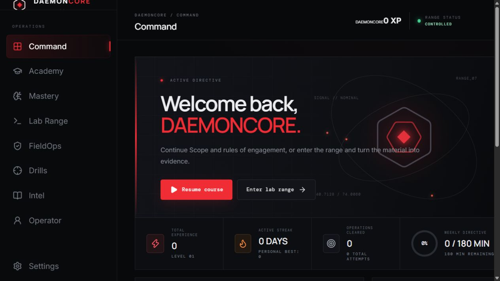
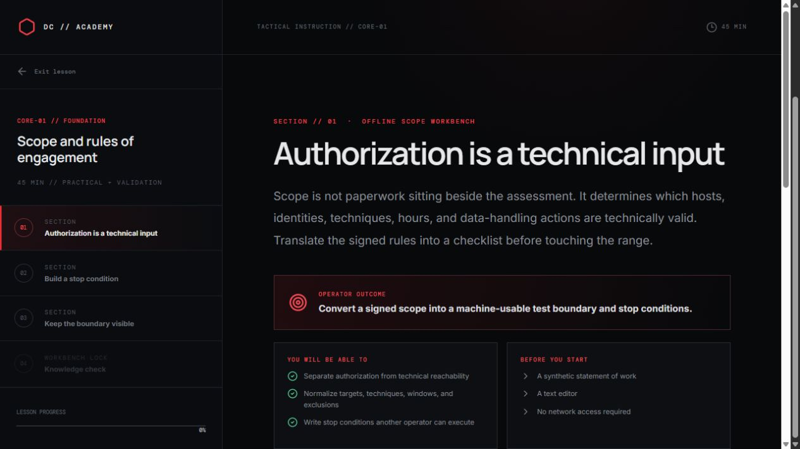
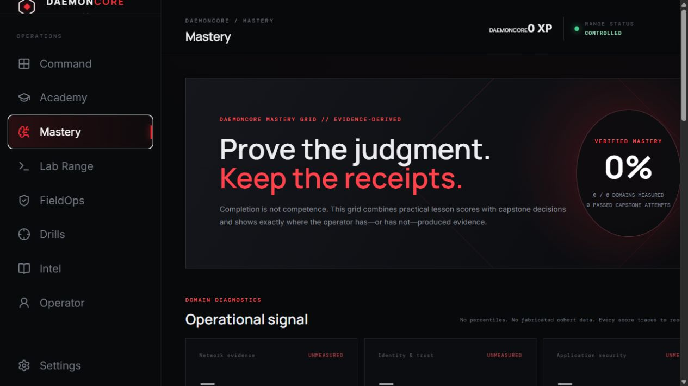
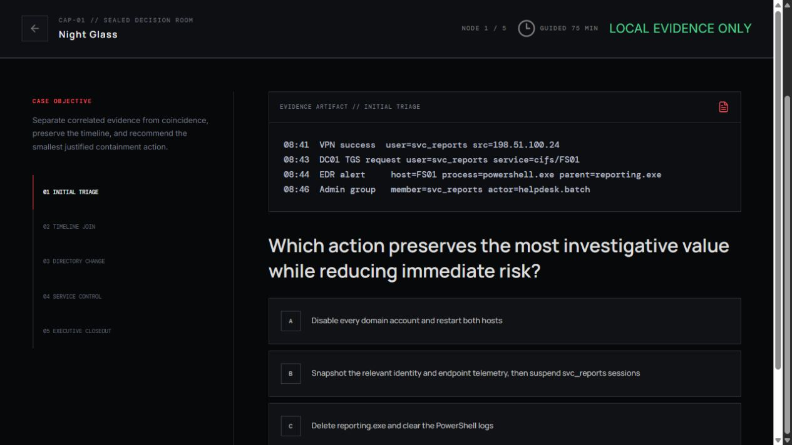
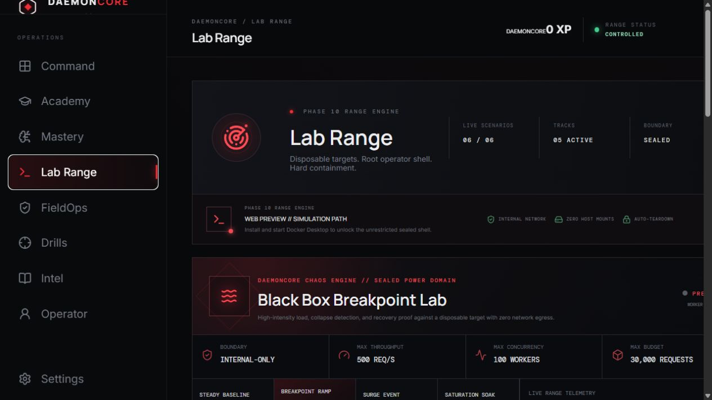
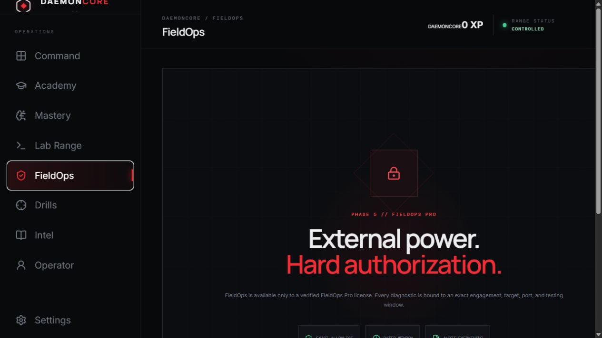

# DaemonCore Academy

> Proprietary commercial software. Source access does not grant permission to copy, redistribute, modify, resell, or bypass licensing. See [LICENSE](LICENSE) and [EULA.md](EULA.md).

I got tired of cyber courses that are either forty hours of passive video or a fake terminal waiting for three magic commands.

DaemonCore is the course I wanted instead: learn the mental model, validate it, drop into a disposable range, collect evidence, and leave with a record you actually earned.

Black glass. Red signal. No seeded XP. No imaginary leaderboard.

## Inside DaemonCore



| Tactical lesson workspace | Evidence-derived Mastery grid |
| --- | --- |
|  |  |

| Principal capstone decision room | Disposable sealed range |
| --- | --- |
|  |  |



## What ships

### FieldOps Workbench // next

- **Asset intelligence** — every successful scoped diagnostic becomes a durable target observation instead of disappearing when the console changes screens.
- **Sealed evidence vault** — diagnostic captures retain their raw result, target, timing, resolved addresses, and an independent SHA-256 digest.
- **Findings register** — operators can promote evidence into a finding with severity, bounded impact, remediation, and an explicit disposition.
- **Evidence-backed retesting** — closure requires a new capture from the same engagement. The register preserves whether the condition was verified fixed or remained present.
- **Professional exports** — the machine-readable case file now includes captures, findings, retests, Chaos runs, and the complete audit chain. A separate printable HTML report is ready for client delivery.
- **One engagement workspace** — diagnostics, target history, evidence, findings, reports, and Chaos Engine runs now live behind the same signed authorization boundary.

### Trust Chain // 5.1

- **Full-tree range fingerprints** — verification now covers every Dockerfile, entrypoint, tool, fixture, case file, scenario contract, and Compose definition. Added files and removed files change the root digest too.
- **Per-file inventory** — the pack index records the relative path, byte count, and SHA-256 of every shipped file under a deterministic `sha256-tree-v1` root.
- **Runtime preflight** — Range Fabric checks Docker Engine, Docker Compose, all nine pack roots, and the enforced containment policy through one desktop diagnostic surface.
- **Digest-sealed launch receipts** — every successful live launch receives a unique receipt binding the runtime version, complete pack digest, containers, network, containment result, and start time.
- **Evidence export** — operators can export the integrity-checked JSON launch receipt before destroying a completed range. The receipt digest is also retained with the mission attempt.
- **Bypass regression tests** — the release contract proves rejection of modified Dockerfiles, injected files, and edited receipts.

### Range Fabric // 5.0

- **Identity Citadel** — the first protocol-native enterprise range provisions a disposable Samba Active Directory realm with live DNS, Kerberos, LDAP, and SMB instead of replaying canned results.
- **A real evidence chain** — operators discover the realm, acquire a Kerberos ticket, query the designated directory edge, and submit a tightly bounded identity finding from the sealed console.
- **Content-addressed packs** — all nine bundled environments have SHA-256 identities. The desktop verifies each pack and refuses a launch if its scenario contract or Compose definition has changed.
- **Pack registry UI** — Lab Range exposes pack status, fingerprints, protocol coverage, and the exact containment sequence enforced before a shell opens.
- **Seven field missions across six tracks** — Network, Web + API, Detection, Cloud, Supply Chain, and Enterprise Identity now progress from live evidence.
- **Regression-proven tamper rejection** — the Phase 15 contract copies a pack, mutates it, and confirms that Range Fabric fails closed.

Remote pack delivery is the next infrastructure layer. It will require a distribution endpoint and an offline-held signing key; neither is simulated or embedded in this repository.

### Enterprise Forge // 4.0

- **Six new specialist pathways** — Windows and Active Directory, Cloud Security Engineering, Detection and Incident Analysis, Linux Privilege and Host Security, Containers and Kubernetes, and Software Supply Chain Defense.
- **Seventy-two complete enterprise lessons** — twelve evidence-led modules per pathway with four instructional stages, four workshops, a three-decision review board, primary references, a required artifact, and a validation check.
- **Forty-eight sealed enterprise cases** — synthetic identity, cloud, endpoint, host, cluster, and build evidence is interrogated through a real in-range CLI and submission service. Completion requires a live accepted condition; there is no browser simulation credit.
- **127 lessons // 120h45m** — eight complete Academy pathways now ship in the application alongside 70 specialist conditions, seven core ranges, eight drills, and three principal capstones.
- **Enterprise progression** — case attempts, time, guidance, score, weekly minutes, completion, XP, and the Enterprise Forged achievement persist in the local operator record.
- **Hard range boundary** — the Enterprise Forge network is internal-only with no published ports, no host mounts, read-only containers, dropped capabilities, resource ceilings, and verified internet-egress denial.

### Web Forge // 3.0

- **Twenty-seven Web + API lessons** — 24h45m covering browser contexts, server interpreters, identity, object authorization, OAuth, JWT, GraphQL, business logic, races, request framing, cache keys, and API resource controls.
- **Twenty-two live Web Forge conditions** — every scenario runs against a purpose-built vulnerable service inside an internal-only Docker network. No canned terminal output and no simulation credit.
- **Evidence-first operation** — each run starts with a scenario contract, establishes a positive control, changes one security variable, and ends only when the live target accepts the precise finding condition.
- **One disposable specialist range** — a root operator console, arbitrary in-range commands, no published ports, no host mounts, dropped capabilities, resource ceilings, and verified internet-egress denial.
- **Durable specialist progression** — attempts, hints, time, operation score, completion, weekly minutes, XP, and the Web Forged achievement are stored in the local operator record.
- **55 complete lessons // 48h45m** — the original full-spectrum path and the new Web specialist path are both available in Academy. FieldOps remains the only paid gate.

### Mastery System // 2.1

- **Three principal capstones** — Night Glass, Broken Orbit, and Red Ledger turn synthetic enterprise, cloud, application, identity, host, and reporting evidence into fifteen scored professional decisions.
- **Evidence-derived mastery grid** — six domain scores combine practical lesson work and capstone decisions without invented rankings or cohort data.
- **Adaptive remediation** — the local operator record identifies the weakest measured domains and routes the operator directly to the most relevant lesson.
- **Persistent decision ledger** — passed and failed capstone attempts retain domain scores and decision trails for honest progress history.

- **Full-Spectrum Security Assessment** — twenty-eight practical lessons and twenty-four hours of guided work spanning scope, recon, Windows and Linux attack surfaces, web, sessions, authorization, injection, APIs, enterprise identity, cloud, containers, supply chain, secrets, validation, evidence, cleanup, and retesting.
- **Advanced operator sequence** — eight hour-long deep dives covering Linux privilege graphs, Windows service control, Active Directory paths, Kerberos trust, segmentation and pivot analysis, SSRF, OAuth/OIDC, and CI/CD provenance.
- **Operator workshops** — every lesson now includes objectives, prerequisites, an annotated three-step workflow, commands or artifacts, expected signal, interpretation, a required deliverable, success criteria, and primary references.
- **Interactive operator workbenches** — twenty-eight tailored simulations with eighty-four decision nodes spanning scope compilation, packet timelines, privilege graphs, directory trust, access matrices, IAM evaluation, provenance, vulnerability triage, and closeout control.
- **Real mastery gating** — the knowledge validation stays locked until the operator passes the lesson workbench. Practical scores and replay attempts are stored in the local operator record.
- **Twenty-eight validation checks** — progress is recorded only after the lesson check is answered correctly.
- **Eight scored drill sets** — protocol recognition, request anatomy, evidence triage, finding quality, authorization, cloud controls, credential safety, and assessment triage.
- **Seven live field missions** — every mission provisions a disposable Docker environment with an unrestricted in-range shell, an internal-only network, zero host mounts, and verified internet-egress denial.
- **Broken Trust live API range** — interrogate an actual synthetic multi-tenant API, compare an owned record with one authorized foreign record, and submit the missing object-authorization condition.
- **Night Shift live forensic range** — verify SHA-256 evidence manifests, build a timeline from raw JSON, isolate high-confidence events, and submit an evidence-backed incident hypothesis.
- **Token Afterlife identity range** — execute a real password-recovery transition, replay the designated pre-reset session, and prove a lifecycle invalidation failure.
- **Policy Collision cloud range** — inspect effective policy, establish expected access, and prove one designated cross-project object read through excessive wildcard scope.
- **Artifact Zero supply-chain range** — verify an SBOM and provenance bundle, identify the deployed digest, and prove that trusted attestations cover different subjects.
- **Six specialist tracks** — Network, Web + API, Detection, Cloud, Supply Chain, and Enterprise Identity progress are calculated directly from completed live missions.
- **Manifest-driven range catalog** — the orchestrator now discovers scenario-specific operators, targets, networks, and containment policies so additional labs scale without weakening the boundary.
- **Four field notes** — short references for recon, HTTP evidence, finding writing, and range rules.
- **A real operator record** — XP, streaks, weekly minutes, attempts, scores, achievements, and activity are calculated from completed work.
- **Local-first data** — atomic writes, backup recovery, JSON export, reset controls, and no account dependency.
- **Lemon Squeezy licensing** — secure activation, instance validation, device deactivation, tier entitlements, and a fourteen-day offline grace window.
- **FieldOps Pro** — authorization-bound diagnostics against exact public targets with persistent asset observations, digest-sealed captures, reviewed findings, evidence-backed retests, and professional reports.
- **Engagement Vault** — append-only scope records, dated testing windows, target and port allowlists, complete case-file export, and a SHA-256 chained activity ledger that exposes tampering.
- **DaemonCore Chaos Engine** — four real black-box resilience profiles with a non-blocking native worker, live latency and error telemetry, automatic SLO aborts, emergency stop, recovery validation, resilience scoring, durable run history, and evidence export.
- **Sealed Power Domain** — a dedicated disposable Chaos Worker can drive up to 500 requests per second, 100 concurrent workers, and 30,000 requests against the Academy black box. The worker and target have no published ports, no host mounts, no privileges, and no internet egress.
- **Readable by default** — the Windows renderer now opens at 125% with saved 100%, 115%, 125%, and 140% interface choices. A typography floor protects dense FieldOps and Chaos telemetry from collapsing back into microscopic labels.

There are no locked “coming soon” course cards pretending to be content. FieldOps is the one intentional commercial gate.

## FieldOps is powerful on purpose

A paid license unlocks the tool. It does not authorize a target.

Before an external diagnostic or Chaos Engine experiment can run, the operator must create an engagement with a client, authorization reference, exact targets, exact TCP ports, a testing window, and an explicit authorization attestation. FieldOps resolves and pins the destination, blocks private, loopback, link-local, reserved, and mixed public/private results, refuses redirects, and writes every completed or blocked action to the evidence ledger. Port surveys are limited to the declared allowlist and thirty ports. Basic resilience sampling is fixed at ten HEAD requests, concurrency one, with at least 500 milliseconds between requests.

Completed diagnostics are retained as digest-sealed captures in the engagement evidence vault. An operator can promote a capture into a reviewed finding, record severity, impact and remediation, change its disposition, and attach a later capture as a formal retest. A closure verdict never overwrites the original evidence. The JSON case file preserves the complete machine-readable record, while the standalone HTML report gives the client a clean finding register that can be printed to PDF.

Chaos Engine provides baseline, controlled-ramp, spike, and bounded-soak profiles against the exact authorized target. Every experiment is capped at sixty seconds, four requests per second, four concurrent probes, and 240 total requests. Operators set P95 latency and error-rate abort conditions before launch. A breached SLO stops the load phase, records the reason, measures recovery, computes a resilience score, and seals the result into the engagement ledger. The emergency stop remains available throughout execution.

Inside the sealed Academy range, the same profiles run through a dedicated high-intensity worker. This power domain is intentionally different: up to 500 requests per second, 100 concurrent workers, and a 30,000-request budget against a disposable target that cannot reach the host or internet. It exists to teach saturation, breakpoint discovery, guardrail design, and recovery engineering with real failure signals instead of a simulation.

There is no arbitrary public-network shell, DDoS engine, or online password-guessing system. High-volume availability testing and credential attacks can damage systems even when someone claims authorization. DaemonCore provides controlled resilience experiments, synthetic identity exercises, sanctioned offline credential-audit training, and the sealed range. Unrestricted command execution stays inside that range.

## Connect Lemon Squeezy

Edit `electron/license-policy.json` before building the commercial installer:

- set the public Lemon Squeezy `storeId`;
- add the product and/or variant IDs for Academy and FieldOps Pro;
- add the hosted checkout URL;
- set `requireAcademyLicense` to `true` when the Academy itself should be gated;
- choose the offline grace length.

These IDs are entitlement policy, not secrets. Never put a Lemon Squeezy management API key in the desktop app. License keys are encrypted through Electron secure storage and the renderer only receives masked metadata.

## The Ghost Port is a real range

When Docker Desktop is available, The Ghost Port provisions a root operator container and a purpose-built target. Nmap and curl return live results, arbitrary shell commands work inside the operator container, and the target is destroyed when the run ends.

The shell is unrestricted. The boundary is not.

Before access is released, DaemonCore verifies an internal-only Docker network, zero host mounts, blocked egress, no privileged containers, dropped capabilities, `no-new-privileges`, and resource ceilings. No target ports are published to the host. Failed containment means no shell.

## Run it from source

Requirements:

- Windows 10 or 11
- Node.js 20+
- Docker Desktop with Linux containers for the live range

```powershell
git clone https://github.com/gtited-jpg/DaemonCore-Academy.git
cd DaemonCore-Academy
npm install
npm run dev
```

`npm run dev:web` runs the browser preview. The preview uses local storage and the simulation path because browsers do not receive the Electron range bridge.

## Break it before shipping it

```powershell
npm test
```

That command lints the UI, exercises operator-record persistence and recovery, verifies licensing and offline grace, attacks the FieldOps scope boundary, enforces the practical-lesson quality contract, validates the range contract and containment-sensitive Compose settings, then builds the production bundle.

Build the Windows installer with:

```powershell
npm run icon
npm run package:win
```

The installer lands in `release/`.

## Project map

```text
electron/data-store.cjs       atomic local operator record
electron/license-manager.cjs  Lemon Squeezy + protected key storage
electron/engagement-store.cjs scope enforcement + external diagnostics
electron/range-orchestrator.cjs
electron/range-integrity.cjs    full-tree fingerprints + receipt verification
ranges/web-range/             22-condition Web + API specialist range
ranges/enterprise-range/      48-case multi-domain enterprise range
ranges/identity-citadel/      protocol-native Samba Active Directory range
ranges/index.json             content-addressed pack registry
ranges/ghost-port/            live target, operator image, and manifest
ranges/ghost-port/chaos-worker high-intensity contained load worker
src/content.js                versioned course, drills, and field notes
src/web-curriculum.js         27-lesson Web + API specialist path
src/web-labs.js               live Web Forge contracts and commands
src/WebRange.jsx              catalog, sealed console, evidence ledger
src/enterprise-curriculum.js  six 12-lesson enterprise pathways
src/enterprise-labs.js        48 enterprise evidence contracts
src/EnterpriseRange.jsx       multi-domain forge catalog
src/lesson-practicals.js      workshops, commands, output, exercises, references
src/phase2.jsx                range console, lessons, and operator record UI
src/ChaosEngine.jsx           experiment composer + live resilience telemetry
src/RangeChaosLab.jsx         sealed-range breakpoint laboratory
scripts/verify-data-store.mjs persistence/recovery contract
scripts/verify-phase4.mjs     licensing and scope-boundary contract
scripts/verify-phase5.mjs     curriculum breadth + bounded FieldOps contract
scripts/verify-phase6.mjs     practical lesson depth and artifact contract
scripts/verify-phase7.mjs     interactive scenario and mastery-gate contract
scripts/verify-phase8.mjs     Chaos Engine caps, abort, recovery, and audit contract
scripts/verify-fieldops-workspace.mjs  captures, findings, retests, and persistence
scripts/verify-phase13.mjs    Web curriculum + live-range quality contract
scripts/verify-phase14.mjs    enterprise depth + containment contract
scripts/verify-phase15.mjs    identity range + pack tamper-rejection contract
scripts/verify-range.mjs      range and containment contract
```

This is training software, not authorization. Use it only on systems you own or have explicit permission to test.
